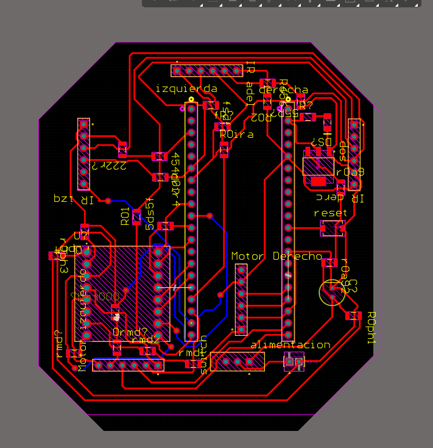

#  Robot Resolvedor de Laberintos (Raspberry Pi Pico 2)

> Robot móvil diferencial que avanza dentro de un laberinto usando **motores DC con encoders** y un **sensor de distancia ToF** frontal (VL53L0X).  
> En esta primera versión, el robot avanza mientras no detecta muro de frente; cuando está demasiado cerca, realiza un giro de 90° a la izquierda.

---

## 1) Resumen

- **Nombre del proyecto:** _Robot Resolvedor de Laberintos_  
- **Autor:** _Antonio Martínez_  
- **Curso / Asignatura:** _Sistemas Embebidos_  
- **Fecha:** _08/12/2025_  
- **Descripción breve:** _Robot diferencial con dos motores y encoders, controlado por un TB6612FNG, que utiliza un sensor VL53L0X frontal para avanzar por el laberinto y girar al detectar un muro._

!!! tip "Información del proyecto"
    - **Lenguaje:** C (Pico SDK)  
    - **MCU:** Raspberry Pi Pico 2 (RP2040)  
    - **Librerías principales:**  
      - `pico/stdlib.h`  
      - `hardware/gpio.h`  
      - `hardware/pwm.h`  
      - `hardware/i2c.h`  
      - `tof.h` (driver del VL53L0X)  
    - **Sensores:**  
      - 1x VL53L0X (ToF) frontal, en bus I2C0  
      - Encoders cuadratura en cada motor  
    - **Actuadores:**  
      - 2 motores DC (Pololu) con encoders  
      - Puente H TB6612FNG  
    - **Tipo de control:**  
      - Robot diferencial (dos ruedas motrices + rueda loca)  
      - Control de velocidad con PWM  
      - Corrección de trayectoria con encoders (funciones de prueba PD y P)

### Material utilizado
- 1x Raspberry Pi Pico 2  
- 1x Puente H TB6612FNG  
- 2x Motores DC con encoder (Pololu u otros equivalentes)  
- 1x Sensor de distancia VL53L0X (ToF)  
- 1x Rueda loca  
- Batería (p. ej. 2S LiPo o 4x AA)  
- Cables, conectores y protoboard / PCB  
- PC con VS Code + CMake + Pico SDK  

---

## 2) Objetivos

- Implementar un **robot diferencial** utilizando un TB6612FNG y dos motores DC con encoders.  
- Leer **encoders** mediante interrupciones para medir el avance de cada rueda.  
- Leer un sensor **VL53L0X** por I2C para medir distancia frontal.  
- Implementar movimientos de alto nivel:
  - Avanzar una cantidad de **ticks** fija.
  - Girar aproximadamente **90°** a través de los encoders.
- Implementar una lógica básica de navegación:
  - Avanzar mientras no haya muro cerca.
  - Girar a la izquierda cuando el muro frontal está demasiado cerca.  

Esta versión sirve como base para integrar posteriormente un **algoritmo completo de resolución de laberintos** (DFS, Flood Fill, etc.).

---

## 3) Circuito

El robot usa una **PCB personalizada** donde se conectan la Raspberry Pi Pico 2, el puente H TB6612FNG, los encoders de los motores, tres módulos de sensores IR y la etapa de alimentación desde una batería de 9 V.

**circuito**
  


### 3.1. Sensores IR (izquierda, frente y derecha)

En la parte superior de la PCB hay tres conectores:

- **IR izq** (`TSW-106-07-S-S`)
- **IR adel** (frontal)
- **IR derc** (derecha)

Cada conector lleva:

- **3V out** (alimentación del módulo IR)
- **GND**
- 1 o 2 líneas de señal hacia la Pico (según el módulo), etiquetadas como:
  - `gp3`, `gp4`, `gp5`, `gp14`, `gp15` (reservados para los IR)

La idea es:

- Poder leer **pared izquierda / derecha / frontal** con sensores IR.
- Tener ya cableado el hardware, aunque en el código de esta primera versión solo se use el **sensor frontal ToF**.

> Esquemático sensores IR + Pico:  
> ``

### 3.2. Motores, encoders y puente H TB6612FNG

En el lado derecho de la PCB están los dos conectores de motor:

- **Motor izquierdo** (`TSW-106-07-S-S`)
  - `M1 / M2`: terminales del motor
  - `C1 / C2`: canales del encoder (izquierda)
  - `VCC` y `GND`

- **Motor derecho**
  - `M1 / M2`: terminales del motor
  - `C1 / C2`: canales del encoder (derecha)
  - `VCC` y `GND`

El puente H es un módulo **ROB-14450 (TB6612FNG)**. El mapeo contra la Pico 2 (según tu esquemático y código) queda:

- **PWM de velocidad**
  - `PWMA` → `gp6` → motor izquierdo  
  - `PWMB` → `gp7` → motor derecho  

- **Dirección de motores**
  - Motor izquierdo:  
    - `AIN1` → `gp9`  
    - `AIN2` → `gp10`
  - Motor derecho:  
    - `BIN1` → `gp11`  
    - `BIN2` → `gp12`

- **Standby**
  - `STBY` se lleva a un GPIO (gp8 + resistor) y se mantiene en **alto**, habilitando el driver.

- **Encoders**
  - Izquierda:
    - `ENC_LA_PIN` → `gp18` (C1 izq)  
    - `ENC_LB_PIN` → `gp19` (C2 izq)
  - Derecha:
    - `ENC_RA_PIN` → `gp16` (C1 der)  
    - `ENC_RB_PIN` → `gp17` (C2 der)

> Esquemático motores + TB6612FNG:  
> ``

### 3.3. Alimentación

La PCB está pensada para alimentarse con una **batería de 9 V**:

1. Conector **“alimentación”**: entra la batería (9 V y GND).
2. Un **switch** en serie permite encender/apagar el robot.
3. Después del switch hay un capacitor de filtrado y una resistencia serie pequeña.
4. Un regulador **LM1117-IMP-5.0** baja la tensión de ~9 V a la tensión de lógica (`3v out` en el esquemático), que alimenta:
   - La Raspberry Pi Pico 2 (a través de su pin de entrada de tensión).
   - El puente H TB6612FNG (`VCC`).
   - Los sensores IR y el resto de la lógica.

Además hay un **LED de encendido** con su resistencia en serie para indicar que la placa está alimentada.

> Esquemático de alimentación:  
> ``

### 3.4. PCB final

La PCB tiene forma casi octagonal para adaptarse al contorno del robot.  
En la vista de ruteo se distinguen:

- Conector de la Pico 2 en el centro-izquierda.
- Conectores de **IR izq / IR adel / IR derc** en el borde superior.
- Conectores de **Motor izquierdo** y **Motor derecho** a los lados.
- Zona de **alimentación** en la parte inferior (conector de batería + switch + regulador).
- Plano de GND y pistas de potencia un poco más gruesas para los motores.

> PCB enrutada del robot:  
> ``


## 4) Código

### 4.1 Código completo

```c


    #include <stdio.h>
    #include <stdint.h>
    #include <stdbool.h>

    #include "pico/stdlib.h"
    #include "hardware/gpio.h"
    #include "hardware/pwm.h"
    #include "hardware/i2c.h"
    #include "pico/binary_info.h"
    #include "tof.h"


    //---------variables de control PID---------
    #define KP_PD   0.015f   // Ganancia proporcional (ajústala)
    #define KD_PD   0.01f    // Ganancia derivativa (ajústala)
    #define I2C_PORT i2c0

    #define XSHUT1 13 //adelante 

    // ---------------- Pines TB6612FNG ----------------
    // Motor IZQUIERDO -> Canal A
    #define AIN1_PIN   10    // AIN1
    #define AIN2_PIN   11    // AIN2
    #define PWMA_PIN   7     // PWMA (PWM)

    // Motor DERECHO -> Canal B
    #define BIN1_PIN   8     // BIN1
    #define BIN2_PIN   9     // BIN2
    #define PWMB_PIN   6     // PWMB

    #define STBY_PIN   12    // STBY (standby, debe estar en 1)

    // ---------------- Encoders ----------------
    // Llanta IZQUIERDA
    #define ENC_LA_PIN   18   // C1 izquierda
    #define ENC_LB_PIN   19   // C2 izquierda

    // Llanta DERECHA
    #define ENC_RA_PIN   16   // C1 derecha
    #define ENC_RB_PIN   17   // C2 derecha

    // ---------------- Parámetros del robot (AJUSTAR) ----------------
    #define TICKS_GIRO_90   300   // VALOR DE EJEMPLO, CÁMBIALO DESPUÉS

    // ---------------- Variables globales encoder ----------------
    volatile int32_t encoder_left_count  = 0;
    volatile int32_t encoder_right_count = 0;

    // PWM
    static uint slice_left;
    static uint slice_right;
    static const uint16_t PWM_WRAP = 1000;  // resolución de PWM (0–1000)

    // Pequeña función abs para int32
    static inline int32_t i32_abs(int32_t x) {
        return (x >= 0) ? x : -x;
    }

    void motor_set_right(int16_t speed) {
        if (speed > 100)  speed = -100;
        if (speed < -100) speed = 100;

        // Aquí invertimos el sentido respecto al izquierdo
        if (speed > 0) {
            // Adelante (pero el motor está físicamente invertido)
            gpio_put(BIN1_PIN, 0);
            gpio_put(BIN2_PIN, 1);
        } else if (speed < 0) {
            // Atrás
            gpio_put(BIN1_PIN, 1);
            gpio_put(BIN2_PIN, 0);
        } else {
            gpio_put(BIN1_PIN, 0);
            gpio_put(BIN2_PIN, 0);
        }

        uint16_t mag = (speed >= 0) ? (uint16_t)speed : (uint16_t)(-speed);
        uint16_t duty = (uint16_t)((mag * PWM_WRAP) / 100);
        pwm_set_gpio_level(PWMB_PIN, duty);
    }

    // Motor IZQUIERDO
    void motor_set_left(int16_t speed) {
        if (speed > 100)  speed = -100;
        if (speed < -100) speed = 100;

        if (speed > 0) {
            gpio_put(AIN1_PIN, 1);
            gpio_put(AIN2_PIN, 0);
        } else if (speed < 0) {
            gpio_put(AIN1_PIN, 0);
            gpio_put(AIN2_PIN, 1);
        } else {
            gpio_put(AIN1_PIN, 0);
            gpio_put(AIN2_PIN, 0);
        }

        uint16_t mag = (speed >= 0) ? (uint16_t)speed : (uint16_t)(-speed);
        uint16_t duty = (uint16_t)((mag * PWM_WRAP) / 100);
        pwm_set_gpio_level(PWMA_PIN, duty);
    }

    // Parar ambos motores
    void robot_parar(void) {
        motor_set_left(0);
        motor_set_right(0);
    }

    // Control PD para que el robot vaya recto usando los encoders
    void robot_prueba_recto_PD(int16_t base_speed, uint32_t duracion_ms, uint32_t paso_ms) {
        encoder_left_count  = 0;
        encoder_right_count = 0;

        float e_prev = 0.0f;  // error anterior

        uint32_t t = 0;
        while (t < duracion_ms) {
            // Leemos los encoders
            int32_t L = encoder_left_count;
            int32_t R = encoder_right_count;

            // Usamos magnitud (valor absoluto) para evitar problemas de signo
            int32_t Lmag = (L >= 0) ? L : -L;
            int32_t Rmag = (R >= 0) ? R : -R;

            // Error: diferencia de distancias recorridas
            float e  = (float)(Lmag - Rmag);
            float de = e - e_prev;   // derivada discreta

            // Ley de control PD
            float u = KP_PD * e + KD_PD * de;

            // Limitamos la corrección para que NO domine a base_speed
            float max_u = base_speed * 0.3f;   // 30% de la velocidad base
            if (u >  max_u) u =  max_u;
            if (u < -max_u) u = -max_u;

            // Calculamos velocidades
            float sL = (float)base_speed - u;
            float sR = (float)base_speed + u;

            // Saturamos a [0, 100] para NO permitir reversa en esta prueba
            if (sL > 100.0f)  sL = 100.0f;
            if (sL < 0.0f)    sL = 0.0f;
            if (sR > 100.0f)  sR = 100.0f;
            if (sR < 0.0f)    sR = 0.0f;

            int16_t speed_left  = (int16_t)sL;
            int16_t speed_right = (int16_t)sR;

            motor_set_left(speed_left);
            motor_set_right(speed_right);

            printf("t=%lu ms | L=%ld | R=%ld | e=%.1f | u=%.2f | sL=%d | sR=%d\n",
                t, L, R, e, u, speed_left, speed_right);

            e_prev = e;
            sleep_ms(paso_ms);
            t += paso_ms;
        }

        robot_parar();
    }

    // ---------------- ISR del encoder para DOS llantas ----------------
    void encoder_isr(uint gpio, uint32_t events) {
        // Leemos siempre todos los canales
        bool aL = gpio_get(ENC_LA_PIN);
        bool bL = gpio_get(ENC_LB_PIN);
        bool aR = gpio_get(ENC_RA_PIN);
        bool bR = gpio_get(ENC_RB_PIN);

        // ---- LLANTA IZQUIERDA ----
        if (gpio == ENC_LA_PIN) {
            if (aL == bL) {
                encoder_left_count++;
            } else {
                encoder_left_count--;
            }
        } else if (gpio == ENC_LB_PIN) {
            if (aL != bL) {
                encoder_left_count++;
            } else {
                encoder_left_count--;
            }
        }

        // ---- LLANTA DERECHA ----
        else if (gpio == ENC_RA_PIN) {
            if (aR == bR) {
                encoder_right_count++;
            } else {
                encoder_right_count--;
            }
        } else if (gpio == ENC_RB_PIN) {
            if (aR != bR) {
                encoder_right_count++;
            } else {
                encoder_right_count--;
            }
        }
    }

    // ---------------- Funciones de alto nivel: robot ----------------

    // Avanzar usando ticks de la llanta izquierda
    void robot_adelante(int16_t base_speed, int32_t ticks_objetivo) {
        encoder_left_count  = 0;
        encoder_right_count = 0;

        const float Kp = 0.1f;     // empieza pequeño
        const int16_t MAX_CORR = 30;   // cuánto máx. puede corregir
        const int16_t MIN_CMD  = 30;   // mínimo para que el motor venza fricción
        const int16_t MAX_CMD  = 255;  // o lo que uses

        motor_set_left(base_speed);
        motor_set_right(base_speed);

        while (1) {
            int32_t ticks_L = encoder_left_count;
            int32_t ticks_R = encoder_right_count;

            int32_t prom = (i32_abs(ticks_L) + i32_abs(ticks_R)) / 2;
            if (prom >= ticks_objetivo) {
                break;
            }

            // error = diferencia de avance entre ruedas
            int32_t error = ticks_L - ticks_R;

            // --- solo P, sin D ---
            float corr_f = Kp * (float)error;
            int16_t corr = (int16_t)corr_f;

            // limitar corrección
            if (corr >  MAX_CORR) corr =  MAX_CORR;
            if (corr < -MAX_CORR) corr = -MAX_CORR;

            int16_t left_cmd  = base_speed - corr;
            int16_t right_cmd = base_speed + corr;

            // NO permitir cambiar de sentido: comandos siempre positivos
            if (left_cmd  < MIN_CMD) left_cmd  = MIN_CMD;
            if (right_cmd < MIN_CMD) right_cmd = MIN_CMD;
            if (left_cmd  > MAX_CMD) left_cmd  = MAX_CMD;
            if (right_cmd > MAX_CMD) right_cmd = MAX_CMD;

            motor_set_left(left_cmd);
            motor_set_right(right_cmd);

            sleep_ms(5);
        }

        robot_parar();
    }

    void robot_adelante_basic(int16_t speed, int32_t ticks_objetivo) {
        encoder_left_count  = 0;
        encoder_right_count = 0;

        motor_set_left(speed);
        motor_set_right(speed);

        while (i32_abs(encoder_left_count) < ticks_objetivo) {
            tight_loop_contents();
        }

        robot_parar();
    }

    void turnL(int16_t base_speed, int32_t ticks_objetivo) {
        encoder_left_count  = 0;
        encoder_right_count = 0;

        const float Kp = 0.1f;     // empieza pequeño
        const int16_t MAX_CORR = 30;   // cuánto máx. puede corregir
        const int16_t MIN_CMD  = 30;   // mínimo para que el motor venza fricción
        const int16_t MAX_CMD  = 255;  // o lo que uses

        motor_set_left(-base_speed);
        motor_set_right(base_speed);

        while (1) {
            int32_t ticks_L = encoder_left_count;
            int32_t ticks_R = encoder_right_count;

            int32_t prom = (i32_abs(ticks_L) + i32_abs(ticks_R)) / 2;
            if (prom >= ticks_objetivo) {
                break;
            }

            // error = diferencia de avance entre ruedas
            int32_t error = ticks_L - ticks_R;

            // --- solo P, sin D ---
            float corr_f = Kp * (float)error;
            int16_t corr = (int16_t)corr_f;

            // limitar corrección
            if (corr >  MAX_CORR) corr =  MAX_CORR;
            if (corr < -MAX_CORR) corr = -MAX_CORR;

            int16_t left_cmd  = base_speed - corr;
            int16_t right_cmd = base_speed + corr;

            // NO permitir cambiar de sentido: comandos siempre positivos
            if (left_cmd  < MIN_CMD) left_cmd  = MIN_CMD;
            if (right_cmd < MIN_CMD) right_cmd = MIN_CMD;
            if (left_cmd  > MAX_CMD) left_cmd  = MAX_CMD;
            if (right_cmd > MAX_CMD) right_cmd = MAX_CMD;

            motor_set_left(left_cmd);
            motor_set_right(right_cmd);

            sleep_ms(5);
        }

        robot_parar();
    }

    // Giro de ~90° a la DERECHA
    void robot_giro_90_derecha(int16_t speed) {
        encoder_left_count  = 0;
        encoder_right_count = 0;

        motor_set_left(speed);
        motor_set_right(-speed);

        while (i32_abs(encoder_left_count) < TICKS_GIRO_90) {
            tight_loop_contents();
        }

        robot_parar();
    }

    // Giro de ~90° a la IZQUIERDA
    void robot_giro_90_izquierda(int16_t speed) {
        encoder_left_count  = 0;
        encoder_right_count = 0;

        motor_set_left(-speed);
        motor_set_right(speed);

        while (i32_abs(encoder_left_count) < TICKS_GIRO_90) {
            tight_loop_contents();
        }

        robot_parar();
    }

    // Prueba: ir recto cierto tiempo y ver pulsos de ambas ruedas
    void robot_prueba_recto(int16_t speed, uint32_t duracion_ms, uint32_t paso_ms) {
        encoder_left_count  = 0;
        encoder_right_count = 0;

        motor_set_left(speed);
        motor_set_right(speed);

        uint32_t t = 0;
        while (t < duracion_ms) {
            printf("t = %lu ms | L = %ld | R = %ld | diff = %ld\n",
                t,
                encoder_left_count,
                encoder_right_count,
                encoder_left_count - encoder_right_count);
            sleep_ms(paso_ms);
            t += paso_ms;
        }

        robot_parar();
    }

    // ---------------- main ----------------
    int main() {
        stdio_init_all();
        sleep_ms(4000);

        // Inicializar I2C para el VL53L0X
        i2c_init(I2C_PORT, 400 * 1000);
        gpio_set_function(PICO_DEFAULT_I2C_SDA_PIN, GPIO_FUNC_I2C);
        gpio_set_function(PICO_DEFAULT_I2C_SCL_PIN, GPIO_FUNC_I2C);
        gpio_pull_up(PICO_DEFAULT_I2C_SDA_PIN);
        gpio_pull_up(PICO_DEFAULT_I2C_SCL_PIN);
        bi_decl(bi_2pins_with_func(PICO_DEFAULT_I2C_SDA_PIN,
                                PICO_DEFAULT_I2C_SCL_PIN,
                                GPIO_FUNC_I2C));

        // XSHUT del VL53L0X
        gpio_init(XSHUT1);
        gpio_set_dir(XSHUT1, GPIO_OUT);
        gpio_put(XSHUT1, 0);
        sleep_ms(50);

        int ok;
        gpio_put(XSHUT1, 1);
        sleep_ms(10);
        ok = tofInit(0, 0x29, 1000);
        if (ok != 1) {
            printf("ERROR iniciando sensor 1 (ret=%d)\n", ok);
            while (1) tight_loop_contents();
        }

        sleep_ms(500);

        //=========================
        // Configuración de motores
        //=========================

        // Motor izquierdo
        gpio_init(AIN1_PIN);
        gpio_set_dir(AIN1_PIN, GPIO_OUT);
        gpio_put(AIN1_PIN, 0);

        gpio_init(AIN2_PIN);
        gpio_set_dir(AIN2_PIN, GPIO_OUT);
        gpio_put(AIN2_PIN, 0);

        // Motor derecho
        gpio_init(BIN1_PIN);
        gpio_set_dir(BIN1_PIN, GPIO_OUT);
        gpio_put(BIN1_PIN, 0);

        gpio_init(BIN2_PIN);
        gpio_set_dir(BIN2_PIN, GPIO_OUT);
        gpio_put(BIN2_PIN, 0);

        // STBY en alto para salir de standby
        gpio_init(STBY_PIN);
        gpio_set_dir(STBY_PIN, GPIO_OUT);
        gpio_put(STBY_PIN, 1);

        // -------- Configuración PWM --------
        // Izquierdo
        gpio_set_function(PWMA_PIN, GPIO_FUNC_PWM);
        slice_left = pwm_gpio_to_slice_num(PWMA_PIN);
        pwm_set_wrap(slice_left, PWM_WRAP);
        pwm_set_clkdiv(slice_left, 100.0f);   // ~1.25 kHz
        pwm_set_gpio_level(PWMA_PIN, 0);
        pwm_set_enabled(slice_left, true);

        // Derecho
        gpio_set_function(PWMB_PIN, GPIO_FUNC_PWM);
        slice_right = pwm_gpio_to_slice_num(PWMB_PIN);
        pwm_set_wrap(slice_right, PWM_WRAP);
        pwm_set_clkdiv(slice_right, 100.0f);
        pwm_set_gpio_level(PWMB_PIN, 0);
        pwm_set_enabled(slice_right, true);

        // -------- Configuración encoders --------
        // Izquierdo
        gpio_init(ENC_LA_PIN);
        gpio_set_dir(ENC_LA_PIN, GPIO_IN);
        gpio_pull_up(ENC_LA_PIN);

        gpio_init(ENC_LB_PIN);
        gpio_set_dir(ENC_LB_PIN, GPIO_IN);
        gpio_pull_up(ENC_LB_PIN);

        // Derecho
        gpio_init(ENC_RA_PIN);
        gpio_set_dir(ENC_RA_PIN, GPIO_IN);
        gpio_pull_up(ENC_RA_PIN);

        gpio_init(ENC_RB_PIN);
        gpio_set_dir(ENC_RB_PIN, GPIO_IN);
        gpio_pull_up(ENC_RB_PIN);

        // Un solo callback para todos los pines de encoder
        gpio_set_irq_enabled_with_callback(
            ENC_LA_PIN,
            GPIO_IRQ_EDGE_RISE | GPIO_IRQ_EDGE_FALL,
            true,
            &encoder_isr
        );
        gpio_set_irq_enabled(ENC_LB_PIN, GPIO_IRQ_EDGE_RISE | GPIO_IRQ_EDGE_FALL, true);
        gpio_set_irq_enabled(ENC_RA_PIN, GPIO_IRQ_EDGE_RISE | GPIO_IRQ_EDGE_FALL, true);
        gpio_set_irq_enabled(ENC_RB_PIN, GPIO_IRQ_EDGE_RISE | GPIO_IRQ_EDGE_FALL, true);

        sleep_ms(1000);
        printf("Inicio robot con TB6612 + encoders izquierda/derecha\n");

        const int LIMITE_FRONT = 120;    // mm (distancia mínima al frente)
        const int16_t VEL_BASE = -20;    // velocidad para avanzar (ajustada a cableado real)
        const int32_t TICKS_PASO = 80;   // cuántos ticks avanza en cada "paso"

        while (true) {
            // ---------- 4.1 Leer sensor frontal ----------
            vl53l0x_setAddress(0x29);   // frontal
            int d_front = tofReadDistance();

            printf("F=%4d mm\n", d_front);

            // Si la lectura del frontal es inválida (<0), trátala como "muy lejos"
            if (d_front < 0) d_front = 2000;

            // ---------- 4.2 Lógica de movimiento ----------
            if (d_front > LIMITE_FRONT) {
                // Hay espacio al frente -> dar un pasito recto
                robot_adelante_basic(VEL_BASE, TICKS_PASO);
            } else {
                // Demasiado cerca del muro frontal
                robot_parar();
                robot_giro_90_izquierda(VEL_BASE);
            }
        }

        return 0;
    }


## 5) Explicación del programa

### 5.1. Mapeo de pines y módulos

**Motores (TB6612FNG):**

Dos funciones principales:

- `motor_set_left(int16_t speed)`
- `motor_set_right(int16_t speed)`

Reciben una velocidad en el rango aproximado `[-100, 100]` y:

- Ajustan la **dirección** (pines `AINx` / `BINx`).
- Ajustan el **duty cycle** del PWM (pines `PWMA` / `PWMB`).

**Encoders:**

- Cada rueda tiene dos canales (A y B).
- La rutina `encoder_isr()` se registra como callback para los flancos de todos los pines de encoder.
- En función del estado relativo de A y B se incrementa o decrementa:
  - `encoder_left_count`
  - `encoder_right_count`

**Sensor VL53L0X:**

- Se inicializa por I2C en la dirección `0x29` usando `tofInit()`.
- En el bucle principal se usa `tofReadDistance()` para obtener la distancia frontal en mm.

---

### 5.2. Funciones de movimiento

- `robot_adelante_basic(int16_t speed, int32_t ticks_objetivo)`  
  Avanza con una velocidad fija hasta que el encoder izquierdo alcanza `ticks_objetivo`.

- `robot_adelante(...)`  
  Similar, pero con una corrección **proporcional** basada en la diferencia de ticks entre ruedas para mantener el rumbo.

- `robot_prueba_recto_PD(...)`  
  Implementa un control **PD** sobre la diferencia de encoders para que el robot avance lo más recto posible, ajustando dinámicamente `sL` y `sR`.

- `robot_giro_90_izquierda(int16_t speed)` y `robot_giro_90_derecha(int16_t speed)`  
  Giran el robot sobre su centro (una rueda hacia adelante y la otra hacia atrás) hasta alcanzar `TICKS_GIRO_90` en el encoder, lo que se calibra para aproximar un giro de 90°.

---

### 5.3. Bucle principal: lógica de navegación

En `main()` se ejecuta un bucle infinito:

1. **Lectura del sensor frontal:**
   - Se obtiene `d_front = tofReadDistance();`.
   - Si `d_front < 0`, se asume que está muy lejos o hubo error de lectura y se reemplaza por `2000` mm.

2. **Decisión de movimiento:**
   - Si `d_front > LIMITE_FRONT` (por ejemplo, 120 mm):  
     - No hay muro cercano → se llama a `robot_adelante_basic(VEL_BASE, TICKS_PASO);`, es decir, se avanza una cantidad de ticks fija.
   - Si `d_front <= LIMITE_FRONT`:  
     - Hay un muro muy cerca → se detiene el robot (`robot_parar()`) y se realiza un giro de 90° a la izquierda (`robot_giro_90_izquierda(VEL_BASE);`).

Esta lógica implementa una **navegación reactiva simple** que evita chocar con el muro frontal y genera un comportamiento tipo “seguir girando a la izquierda” cuando encuentra obstáculos.

---

## 6) Consideraciones de hardware

**Calibración de `TICKS_GIRO_90`:**  
El valor `#define TICKS_GIRO_90 300` es aproximado. Debe calibrarse empíricamente haciendo girar el robot sobre sí mismo y ajustando hasta obtener un giro de ~90°.

**Velocidad y signo de `VEL_BASE`:**  
En el código se usa `VEL_BASE = -20`. Esto se debe a la forma en que están conectados los motores y a cómo se definieron los sentidos en `motor_set_left()` y `motor_set_right()`.  
Si al probar el robot este avanza hacia atrás, bastará con cambiar el signo o la convención de pines.

**Alimentación:**

- Es recomendable usar **alimentación separada** para motores y lógica (por ejemplo, LiPo para motores y regulador a 5 V / 3.3 V para la Pico).
- Siempre unir las **tierras (GND)**.

**Ruido de motores:**  
Los motores pueden introducir ruido en la alimentación y afectar el I2C o incluso causar resets. Es recomendable:

- Colocar capacitores de **desacople** cerca de la Pico y del TB6612.
- Mantener los cables de señales lo más cortos posible.

**Montaje del sensor VL53L0X:**  
D


<div style="position:relative;padding-bottom:56.25%;height:0;overflow:hidden;">
  <iframe
    src="https://www.youtube.com/embed/dFpt2ZIkJl8"
    title="YouTube video"
    allow="accelerometer; autoplay; clipboard-write; encrypted-media; gyroscope; picture-in-picture; web-share"
    allowfullscreen
    style="position:absolute;top:0;left:0;width:100%;height:100%;border:0;">
  </iframe>
</div>
