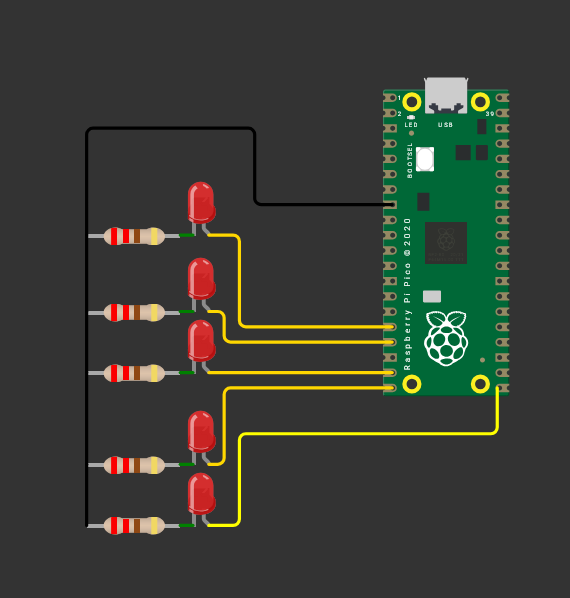

#  Barrido de LEDs  

> Esta práctica consiste en implementar un barrido de LEDs en el Raspberry Pi Pico, donde cinco LEDs muestran un “1” que se desplaza de izquierda a derecha y de regreso (0→1→2→3→4→3→2→1…), reforzando el uso de operaciones lógicas y control de salidas digitales.  

---

## 1) Resumen

- **Nombre del proyecto:** _Barrido de LEDs_  
- **Equipo / Autor(es):** _Antonio Martínez_  
- **Curso / Asignatura:** _Sistemas Embebidos_  
- **Fecha:** _25/08/2025_  
- **Descripción breve:** _Se programó un barrido de LEDs controlados por el Raspberry Pi Pico._  

!!! tip "Información del proyecto:"
    C: Se utiliza el lenguaje C con el SDK de Raspberry Pi Pico, aprovechando librerías como pico/stdlib.h para el manejo de GPIO y retardos de tiempo.  
    - Raspberry Pi Pico / Pico 2  

### Material utilizado: 
- Cable micro-USB / USB-C para la programación y alimentación  
- Protoboard  
- 5 LEDs de 5 mm o SMD  
- 5 resistencias (220 Ω – 330 Ω) para limitar la corriente de los LEDs  
- Cables de conexión (jumpers)  
- Computadora con Visual Studio Code y el entorno Pico SDK configurado  
- Alimentación (a través del puerto USB del Pico)  

---

## 2) Objetivos

- **Comprender el uso de salidas digitales en el microcontrolador**  
Configurar pines GPIO del Raspberry Pi Pico como salidas para controlar LEDs.  

- **Implementar un patrón dinámico de iluminación**  
Mostrar un barrido secuencial donde un LED encendido se desplaza a lo largo de cinco posiciones y regresa.  

- **Aplicar lógica de control secuencial**  
Usar variables de posición y dirección para generar el movimiento del “1” en el arreglo de LEDs.  

- **Familiarizarse con retardos en sistemas embebidos**  
Implementar pausas controladas para observar el movimiento del LED encendido.  

- **Relacionar teoría con práctica**  
Visualizar cómo las operaciones lógicas permiten implementar un control dinámico de hardware.  

---

## 3) Circuito

La siguiente imagen muestra las conexiones realizadas, se utilizaron 5 resistencias de 220 ohms y 5 LEDs rojos.  

  


---

## 4) Código

```c
#include <stdio.h>
#include <stdint.h>
#include "pico/stdlib.h"

#define LED0 0
#define LED1 1
#define LED2 2
#define LED3 3
#define LED4 4

#define LED_MASK ((1u << LED0) | (1u << LED1) | (1u << LED2) | (1u << LED3) | (1u << LED4))

int main() {
    stdio_init_all();
    gpio_init_mask(LED_MASK);
    gpio_set_dir_out_masked(LED_MASK);

    int pos = 0;
    int dir = 1; // 1 = derecha, -1 = izquierda

    while (true) {
        uint32_t value = (1u << pos);
        gpio_put_masked(LED_MASK, value);
        sleep_ms(200);

        pos += dir;

        if (pos == 4) dir = -1; // extremo derecho
        if (pos == 0) dir = 1;  // extremo izquierdo
    }
    return 0;
}
```

## 5) Explicación del programa 
- Definiciones y máscara
```c
#define LED0 0
#define LED1 1
#define LED2 2
#define LED3 3
#define LED4 4

#define LED_MASK ((1u << LED0) | (1u << LED1) | (1u << LED2) | (1u << LED3) | (1u << LED4))
```
Se asignan los pines 0–4 para los LEDs. La máscara permite inicializar y escribir en todos esos pines simultáneamente.

- Inicialización
```c
gpio_init_mask(LED_MASK);
gpio_set_dir_out_masked(LED_MASK);
```
Los pines definidos se configuran como salida.

- Bucle principal
```c
uint32_t value = (1u << pos);
gpio_put_masked(LED_MASK, value);
```
Solo el LED en la posición actual se enciende.

La variable dir controla la dirección del movimiento.
Cuando llega al extremo derecho (LED4) cambia a izquierda, y al llegar al extremo izquierdo (LED0) cambia a derecha, logrando el efecto de ida y vuelta.