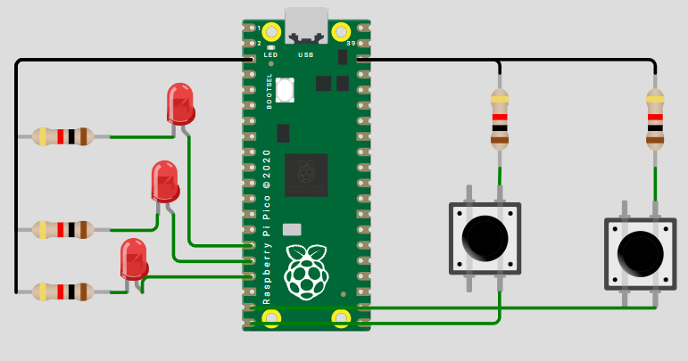

#  Compuertas Lógicas con Botones y LED (Raspberry Pi Pico / Pico 2)

> Implementación de compuertas lógicas (AND, OR, NOT, XOR, NAND, NOR) usando **dos botones** como entradas digitales y **un LED** como salida.  
> Los botones usan **pull-up** interno (activos en **bajo** al presionar), y se incluye un **debounce** por software.

---

## 1) Resumen

- **Nombre del proyecto:** _Compuertas Lógicas con GPIO_  
- **Autor:** _Antonio Martínez_  
- **Curso / Asignatura:** _Sistemas Embebidos_  
- **Fecha:** _02/09/2025_  
- **Descripción breve:** _Se mapean dos entradas con botones a una salida LED que refleja la operación lógica seleccionada._

!!! tip "Información del proyecto"
    - **Lenguaje:** C (Pico SDK)  
    - **MCU:** Raspberry Pi Pico / Pico 2 (RP2040)  
    - **Librerías:** `pico/stdlib.h`, `hardware/gpio.h`  
    - **Entradas activas en:** nivel **bajo** (por pull-up interno → al presionar = 0 lógico)  
    - **Salida LED activa en:** nivel **alto**

### Material utilizado
- Raspberry Pi Pico / Pico 2  
- 1 LED (salida) + 1 resistencia 220–330 Ω  
- 2 botones de pulso (entradas)  
- Cables, protoboard y cable USB  
- PC con VS Code + CMake + Pico SDK

---

## 2) Objetivos

- Configurar **GPIO** como entradas con `pull_up` y como salidas para LED.  
- Implementar **compuertas lógicas** básicas con entradas discretas.  
- Manejar el **rebote** de botones por software de forma simple.  
- Proveer una base extensible para probar distintas compuertas.

---

## 3) Circuito

- **Entradas (botones):**
  - `BTN_A` → GPIO 14 — con `gpio_pull_up(BTN_A)`  
  - `BTN_B` → GPIO 15 — con `gpio_pull_up(BTN_B)`  
  - El otro terminal de cada botón va a **GND**
- **Salida (LED):**
  - `LED_OUT` → GPIO 13  
  - LED con resistencia en **serie** (220–330 Ω), ánodo al GPIO y cátodo a **GND** (salida activa-alta)
- **Tierra común:** compartir GND entre todos los elementos.
  
---

## 4) Código

> Cambia `GATE_SELECTED` para elegir la compuerta a evaluar.

```c

    #include <stdio.h>
    #include <stdbool.h>
    #include "pico/stdlib.h"
    #include "hardware/gpio.h"

    // ========= Mapeo de pines =========
    #define BTN_A    14
    #define BTN_B    15
    #define LED_OUT  13

    // ========= Selección de compuerta =========
    // Opciones: AND, OR, NOT_A, XOR, NAND, NOR
    typedef enum { AND, OR, NOT_A, XOR, NAND, NOR } gate_t;
    #define GATE_SELECTED AND   // <- Cambia aquí la compuerta a evaluar

    // ========= Parámetros de debounce =========
    #define DEBOUNCE_MS 20
    static absolute_time_t next_read_time = {0};

    // Lee botón con pull-up y entrega 0/1 lógico (1 = presionado)
    static inline bool read_button_active_low(uint pin) {
        // Con pull-up: gpio_get(pin) == 1 (no presionado), 0 (presionado)
        return gpio_get(pin) ? 0 : 1;
    }

    static inline bool debounce_ready(void) {
        return absolute_time_diff_us(get_absolute_time(), next_read_time) <= 0;
    }

    static inline void debounce_arm(void) {
        next_read_time = make_timeout_time_ms(DEBOUNCE_MS);
    }

    static bool logic_eval(gate_t gate, bool a, bool b) {
        switch (gate) {
            case AND:   return (a && b);
            case OR:    return (a || b);
            case NOT_A: return (!a);        // ignora B
            case XOR:   return (a ^ b);
            case NAND:  return !(a && b);
            case NOR:   return !(a || b);
            default:    return false;
        }
    }

    int main(void) {
        stdio_init_all();

        // Configuración de pines
        gpio_init(LED_OUT);
        gpio_set_dir(LED_OUT, true);
        gpio_put(LED_OUT, 0);

        gpio_init(BTN_A);
        gpio_set_dir(BTN_A, false);
        gpio_pull_up(BTN_A);

        gpio_init(BTN_B);
        gpio_set_dir(BTN_B, false);
        gpio_pull_up(BTN_B);

        debounce_arm();

        while (true) {
            if (!debounce_ready()) {
                sleep_ms(1);
                continue;
            }

            // Lectura de entradas (1 = presionado, 0 = suelto)
            bool A = read_button_active_low(BTN_A);
            bool B = read_button_active_low(BTN_B);

            // Evaluación lógica
            bool Y = logic_eval(GATE_SELECTED, A, B);

            // Actualizar salida
            gpio_put(LED_OUT, Y ? 1 : 0);

            // Rearmar debounce
            debounce_arm();
        }

        return 0;
    }

## 5) Explicación del programa

### a) Definiciones y mapeo de pines
- **Cancha / Entradas:** `BTN_A` (GPIO 14), `BTN_B` (GPIO 15), ambos con **pull-up** interno (activos en **bajo**).  
- **Salida / Puntuación:** `LED_OUT` (GPIO 13), activo en **alto** (enciende con `1`).  

---

### b) Variables clave (estado del juego)
- **Entradas A, B:** se leen con la función `read_button_active_low()`, que invierte la lógica de `gpio_get()` para que **1 = presionado**.  
- **Compuerta seleccionada:** `GATE_SELECTED` de tipo `gate_t` (AND / OR / NOT_A / XOR / NAND / NOR).  
- **Debounce:** `DEBOUNCE_MS` define la ventana mínima entre lecturas estables.  

---

### c) Inicialización de GPIO y botones
- LED como **salida** y en **bajo** al inicio (`gpio_put(LED_OUT, 0)`).  
- Botones como **entrada** con `gpio_pull_up()`.  
- La inversión lógica se concentra en `read_button_active_low()` para mantener el código limpio.  

---

### d) Bucle principal
- Cada **DEBOUNCE_MS** (20 ms por defecto) se muestrean A y B.  
- Se evalúa `logic_eval(GATE_SELECTED, A, B)`.  
- Se escribe la salida en `LED_OUT`.  

---

### e) Tablas de verdad (referencia)

**Supuesto:** 1 = botón presionado; 0 = suelto.  

| A | B | AND | OR | XOR | NAND | NOR |
|---|---|-----|----|-----|------|-----|
| 0 | 0 |  0  |  0 |  0  |  1   |  1  |
| 0 | 1 |  0  |  1 |  1  |  1   |  0  |
| 1 | 0 |  0  |  1 |  1  |  1   |  0  |
| 1 | 1 |  1  |  1 |  0  |  0   |  0  |

**Para NOT_A (usa solo A):**

| A | NOT_A |
|---|-------|
| 0 |   1   |
| 1 |   0   |

---


## 6) Consideraciones de hardware
- **Resistencia del LED:** 220–330 Ω en serie.  
- **Botones con pull-up:** el otro terminal a **GND**.  
- **Común de GND:** imprescindible para referencia de niveles.  
- **Rebotes:** el debounce por soft (20 ms) suele ser suficiente. Si observas parpadeos, sube a **30–40 ms** o añade filtro **RC**.  
- **Polaridad del LED:** si está invertido (cátodo al GPIO), deberás invertir la lógica de `gpio_put()`.  

---
## Video de demostración

<div style="position:relative;padding-bottom:56.25%;height:0;overflow:hidden;">
  <iframe
    src="https://www.youtube.com/embed/twmNGeeP-nU"
    title="YouTube video"
    allow="accelerometer; autoplay; clipboard-write; encrypted-media; gyroscope; picture-in-picture; web-share"
    allowfullscreen
    style="position:absolute;top:0;left:0;width:100%;height:100%;border:0;">
  </iframe>
</div>
