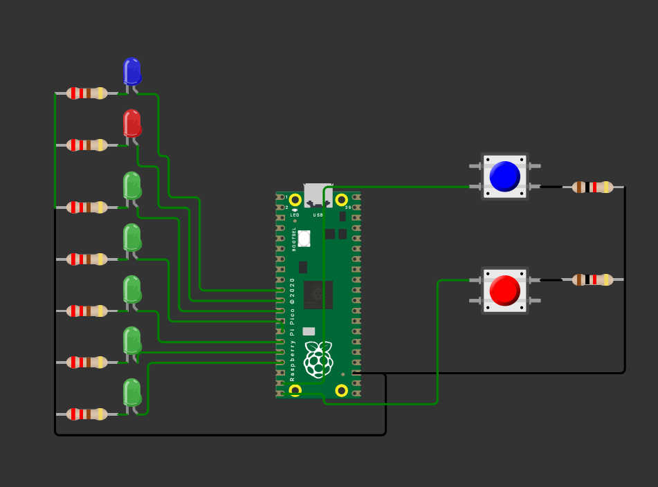

#  Juego tipo “Pong” con LEDs e interrupciones (Raspberry Pi Pico)  

> Esta práctica implementa un “Pong” lineal con 5 LEDs. Una “pelota” recorre de izquierda a derecha y viceversa (posiciones 1↔5). Cada jugador tiene un botón: si lo presiona cuando la pelota llega a su extremo, cambia la dirección y “devuelve” el tiro. Si nadie responde y la pelota “sale” por un extremo, se marca punto: se enciende un LED de “anotación” del lado ganador durante 2 s y el juego reinicia desde el centro.  

---

## 1) Resumen

- **Nombre del proyecto:** _Pong de LEDs con interrupciones_  
- **Equipo / Autor(es):** _Antonio Martínez_  
- **Curso / Asignatura:** _Sistemas Embebidos_  
- **Fecha:** _01/09/2025_  
- **Descripción breve:** _Juego de “Pong” unidimensional usando 5 LEDs para la pelota, 2 salidas para puntos y 2 botones con interrupciones para devolver la pelota en los extremos._  

!!! tip "Información del proyecto:"
    **Lenguaje/SDK:** C con Raspberry Pi Pico SDK (`pico/stdlib.h`).  
    **Técnicas clave:** manejo de GPIO, **interrupciones** por flanco de bajada, pull-ups internos, lógica de estados.  
    **Plataforma:** Raspberry Pi Pico / Pico 2.  

### Material utilizado
- Raspberry Pi Pico (o Pico 2) + cable micro-USB/USB-C  
- Protoboard  
- **7 LEDs** (5 para “cancha”, **2 para puntos** J1/J2)  
- **7 resistencias** 220–330 Ω (una por LED)  
- **2 botones** momentáneos
- **2 resistencias** 1K-2K Ω para los botones
- Cables de conexión (jumpers)  
- PC con VS Code + Pico SDK configurado  

---

## 2) Objetivos

- **Usar interrupciones GPIO** para leer botones con pull-up interno (activo en bajo).  
- **Modelar la lógica de juego** con variables de posición (`pos`) y dirección (`dir`).  
- **Indicar estado del juego en hardware:** 5 LEDs para pelota, 2 salidas para “punto”.  
- **Practicar estructura de programa embebido** (inicialización–ISR–bucle principal).  

---

## 3) Conexiones / Esquema

**Botones (activos en bajo):**  
- Un terminal del botón a **GND**; el otro a **GPIO 14** (BTN_AVANZA) y **GPIO 15** (BTN_RETRO). Se habilita `gpio_pull_up()`, por lo que al presionar el botón, la línea cae a 0 (flanco de bajada).

**LEDs “cancha” (con resistencia a GND):**  
- `LED4 → GPIO 9`  
- `LED0 → GPIO 10`  
- `LED1 → GPIO 11`  
- `LED2 → GPIO 12`  
- `LED3 → GPIO 13`

**LEDs de “punto” (o zumbadores, según el montaje):**  
- `J1 → GPIO 7` (punto del jugador izquierdo)  
- `J2 → GPIO 8` (punto del jugador derecho)

> Recomendación: conectar **ánodo del LED** a GPIO mediante resistencia serie y **cátodo a GND**. Con `gpio_put(pin, 1)` el LED enciende.

**Tabla rápida de pines**

| Señal        | GPIO | Uso                     |
|--------------|------|-------------------------|
| BTN_AVANZA   | 14   | Botón jugador izquierdo |
| BTN_RETRO    | 15   | Botón jugador derecho   |
| LED4         | 9    | Posición 1 (extremo izq)|
| LED0         | 10   | Posición 2              |
| LED1         | 11   | Posición 3 (centro)     |
| LED2         | 12   | Posición 4              |
| LED3         | 13   | Posición 5 (extremo der)|
| J1           | 7    | Indicador de punto izq  |
| J2           | 8    | Indicador de punto der  |

---
**Diagrama de conexión**
  


## 4) Código

```c
#include "pico/stdlib.h"
#include <stdbool.h>

#define BTN_AVANZA 14
#define BTN_RETRO  15

#define LED4 9
#define LED0 10
#define LED1 11
#define LED2 12
#define LED3 13
#define J1 7
#define J2 8

bool Ju1 = false;   // estado botón jugador 1
bool Ju2 = false;   // estado botón jugador 2
int pos = 1;        // posición inicial de la pelota
int dir = 1;        // dirección inicial: 1=derecha, -1=izquierda

static void accion(uint gpio, uint32_t events) {
    // FIX: habilitaste FALL en main; aquí también revisa FALL y atiende ambos botones
    if (events & GPIO_IRQ_EDGE_FALL) {
        if (gpio == BTN_AVANZA) { if (pos == 1 /*&& Ju1*/) dir = 1; }  // Ju1 opcional
        if (gpio == BTN_RETRO)  { if (pos == 5 /*&& Ju2*/) dir = -1; } // Ju2 opcional
    }
    gpio_acknowledge_irq(gpio, events);
}

int main() {
    stdio_init_all();

    const uint LEDS[5] = { LED4, LED0, LED1, LED2, LED3 };  // 9,10,11,12,13

    for (int i = 0; i < 5; i++) {                  // FIX: antes era < 4
        gpio_init(LEDS[i] );
        gpio_set_dir(LEDS[i], true);
        gpio_put(LEDS[i], 0);                      // FIX: apaga inicialmente
    }

    const uint PUNTOS[2] = { J1, J2 };
    for (int i = 0; i < 2; i++) {
        gpio_init(PUNTOS[i] );                      // FIX: inicializa PUNTOS, no LEDS
        gpio_set_dir(PUNTOS[i], true);              // FIX: salida
        gpio_put(PUNTOS[i], 0);                     // FIX: apaga inicialmente
    }

    // Botones como entrada con pull-up (activo en bajo)
    gpio_init(BTN_AVANZA); gpio_set_dir(BTN_AVANZA, false); gpio_pull_up(BTN_AVANZA);
    gpio_init(BTN_RETRO);  gpio_set_dir(BTN_RETRO,  false); gpio_pull_up(BTN_RETRO);

    // IRQ: instalas callback con el primero y habilitas también el segundo
    gpio_set_irq_enabled_with_callback(BTN_AVANZA, GPIO_IRQ_EDGE_FALL, true, &accion);
    gpio_set_irq_enabled(BTN_RETRO,  GPIO_IRQ_EDGE_FALL, true);

    while (true) {
        // (Opcional) actualizar flags de botones si los quieres usar en otro lado
        Ju1 = !gpio_get(BTN_AVANZA);
        Ju2 = !gpio_get(BTN_RETRO);

        // --- Movimiento automático ---
        pos += dir;

        // Rebotes en bordes si nadie responde
        if (pos == 6) {
            for (int i = 0; i < 5; i++) gpio_put(LEDS[i], 1);
            gpio_put(J2, 1);
            sleep_ms(2000);
            gpio_put(J2, 0);
            pos = 3;
            // (tu lógica original no reubica pos ni dir aquí más allá del if)
        }

        if (pos == 0) {
            for (int i = 0; i < 5; i++) gpio_put(LEDS[i], 1);
            gpio_put(J1, 1);
            sleep_ms(2000);
            gpio_put(J1, 0);
            pos = 3;
        }

        // --- Mostrar LEDs ---
        for (int i = 0; i < 5; i++) {
            gpio_put(LEDS[i], (i + 1 == pos));     // LEDS[0] ↔ pos=1 ... LEDS[4] ↔ pos=5
        }

        sleep_ms(250);
    }
}
```

## 5) Explicación del programa

### a) Definiciones y mapeo de pines

- **Botones:** `BTN_AVANZA=14`, `BTN_RETRO=15` (entradas con *pull-up*, **activos en bajo**).
- **LEDs “cancha”:** `LED4=9`, `LED0=10`, `LED1=11`, `LED2=12`, `LED3=13`.  
  Se agrupan en `LEDS[5] = { LED4, LED0, LED1, LED2, LED3 }`, donde `pos=1` corresponde a `LEDS[0]` (GPIO 9) y `pos=5` a `LEDS[4]` (GPIO 13).
- **Indicadores de punto:** `J1=7` (izquierda), `J2=8` (derecha). Se configuran como **salidas** y se encienden 2 s al anotar.


### b) Variables de estado

- `pos ∈ {1,2,3,4,5}` indica la posición de la pelota.  
- `dir ∈ {+1, −1}` define la dirección (derecha/izquierda).  
- `Ju1`, `Ju2` sirven como *flags* de lectura (opcionales, el juego funciona sin usarlas).

### c) Interrupción `accion()`

- Se activa con **flanco de bajada** (`GPIO_IRQ_EDGE_FALL`) en cualquiera de los dos botones.
- **Lógica de “devolución”:**
  - Si la pelota está en el **extremo izquierdo** (`pos==1`) y cae el botón izquierdo (`BTN_AVANZA`), se fuerza `dir = +1`.
  - Si está en el **extremo derecho** (`pos==5`) y cae el botón derecho (`BTN_RETRO`), se fuerza `dir = −1`.
- Se llama a `gpio_acknowledge_irq()` para limpiar el evento atendido.

### d) Inicialización en `main()`

- `LEDS` y `PUNTOS` se inicializan como **salidas** y se apagan.  
- Botones se configuran como **entradas** con `gpio_pull_up()`.  
- Se registra la **ISR** con `gpio_set_irq_enabled_with_callback()` en `BTN_AVANZA` y se habilita también la IRQ de `BTN_RETRO`.

### e) Bucle principal

- (Opcional) Actualiza `Ju1`/`Ju2` leyendo el estado instantáneo de los botones.  
- **Movimiento:** `pos += dir;`  
- **Punto/anotación** si la pelota “sale”:
  - **Derecha:** si `pos==6`, se encienden todos los LEDs de cancha, se activa `J2` por 2 s y se reinicia `pos=3`.
  - **Izquierda:** si `pos==0`, se encienden todos los LEDs de cancha, se activa `J1` por 2 s y se reinicia `pos=3`.  
  *(La dirección `dir` no se reorienta explícitamente tras el punto.)*
- **Render:** se enciende únicamente el LED cuyo **índice+1 == pos**.
- **Velocidad:** `sleep_ms(250)` define la dificultad.

---

## 6) Pruebas y comportamiento esperado

- **Arranque:** un único LED encendido en la posición 1; la “pelota” avanza hacia la derecha (`dir=+1`).  
- **Devolución correcta:** al llegar al LED extremo, si el jugador correspondiente **presiona a tiempo**, la pelota cambia de sentido sin salir.  
- **Fallo:** si nadie presiona y la pelota intenta pasar de `5→6` o `1→0`, se marca **punto** (`J2` o `J1`, respectivamente) y se reinicia en el centro (`pos=3`).  

---


## Video de demostración


<div style="position:relative;padding-bottom:56.25%;height:0;overflow:hidden;">
  <iframe
    src="https://www.youtube.com/embed/2d4McjVFlx8"
    title="YouTube video"
    allow="accelerometer; autoplay; clipboard-write; encrypted-media; gyroscope; picture-in-picture; web-share"
    allowfullscreen
    style="position:absolute;top:0;left:0;width:100%;height:100%;border:0;">
  </iframe>
</div>
