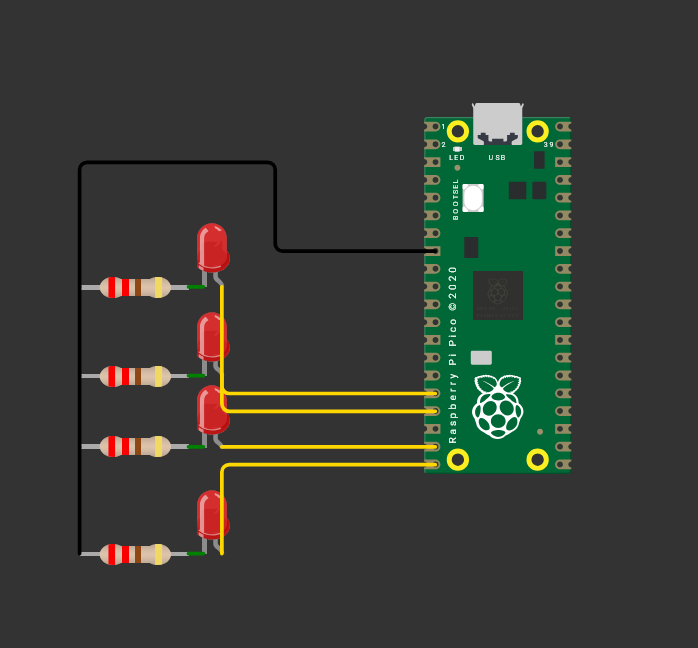

#  Contador Binario de 4 Bits  

> Esta práctica consiste en implementar un contador binario de 4 bits utilizando el Raspberry Pi Pico, donde cuatro LEDs muestran en tiempo real la representación binaria de los números del 0 al 15. El objetivo es aplicar el uso de operaciones lógicas y máscaras para el control de salidas digitales y reforzar la comprensión del sistema binario..  


---

## 1) Resumen

- **Nombre del proyecto:** _Contador Binario de 4 bits_  
- **Equipo / Autor(es):** _Antonio Martínez_  
- **Curso / Asignatura:** _Sistemas Embebidos_  
- **Fecha:** _25/08/2025_  
- **Descripción breve:** _Se programo un contador binario de cuatro bits._

!!! tip "Información del proyecto:"
    C: Se utiliza el lenguaje C con el SDK de Raspberry Pi Pico, aprovechando librerías como pico/stdlib.h para el manejo de GPIO y retardos de tiempo.
    - Raspberry Pi Pico / Pico 2  

### Material utilizado: 
- Cable micro-USB / USB-C para la programación y alimentación  
- Protoboard  
- 4 LEDs de 5 mm o SMD  
- 4 resistencias (220 Ω – 330 Ω) para limitar la corriente de los LEDs  
- Cables de conexión (jumpers)  
- Computadora con Visual Studio Code y el entorno Pico SDK configurado  
- Alimentación (a través del puerto USB del Pico)  


---
## 1) Objetivos

- Objetivos de la práctica

- Comprender el uso de salidas digitales en el microcontrolador
Configurar los pines GPIO del Raspberry Pi Pico como salidas para controlar LEDs.

- Implementar un contador binario en hardware
Representar en 4 LEDs la cuenta de 0 a 15, utilizando operaciones lógicas y máscaras para manipular bits.

- Aplicar lógica de desplazamiento y enmascaramiento
Utilizar operadores bit a bit (<<, &, |) para mapear valores binarios a los pines seleccionados del microcontrolador.

- Familiarizarse con el control de tiempo en programas embebidos
Manejar retardos en milisegundos para visualizar la secuencia del contador en los LEDs.

- Relacionar teoría con práctica
Observar cómo los números en base binaria se traducen en encendidos y apagados de LEDs, reforzando el entendimiento de la representación binaria en sistemas digitales.


## 2) Circuito

La siguiente imagen muestra las conexiones realizadas, se utilizaron 4 resistencias de 220 ohms y 4 leds rojos 





---

## 3) Codigo

```c
#include <stdio.h>
#include "pico/stdlib.h"
#define A 12
#define B 13    
#define C 14
#define D 15

const uint32_t LED_MASK = (1u << A) | (1u << B) | (1u << C) | (1u << D) ;
                   

int main() {
    stdio_init_all();
    gpio_init_mask(LED_MASK);
    gpio_set_dir_out_masked(LED_MASK);
    gpio_put_masked(LED_MASK, 0);

    while (true) {
        
        for (uint32_t n = 0; n < 16; n++) {
            gpio_put_masked(LED_MASK, n<<12);
            sleep_ms(1000);
        } 
       /* gpio_put_masked(LED_MASK, LED_MASK);*/
    }
    return 0;
}

```

## 4) Explicación del programa 

Explicación del código

Este programa implementa un contador binario de 4 bits en un Raspberry Pi Pico usando los GPIO 12–15 para controlar cuatro LEDs.

Definiciones y máscara
```c
#define A 12
#define B 13
#define C 14
#define D 15

const uint32_t LED_MASK = (1u << A) | (1u << B) | (1u << C) | (1u << D);
```

Se asignan nombres a los pines.

La máscara (LED_MASK) permite configurar y escribir en todos los pines a la vez.
```c
Inicialización
gpio_init_mask(LED_MASK);
gpio_set_dir_out_masked(LED_MASK);
gpio_put_masked(LED_MASK, 0);
```

Inicializa los pines 12–15, los configura como salida y los apaga.
```c
Bucle principal
for (uint32_t n = 0; n < 16; n++) {
    gpio_put_masked(LED_MASK, n << 12);
    sleep_ms(1000);
}

```
Recorre los valores de 0 a 15 (0000–1111 en binario).

n << 12 alinea el número con los GPIO 12–15.

Cada segundo se actualiza el estado de los LEDs mostrando el conteo binario.

## 5) Video del Funcionamiento:

## Demostración en video


<video width="600" controls>
  <source src="../recursos/imgs/contador.mp4">
</video>
