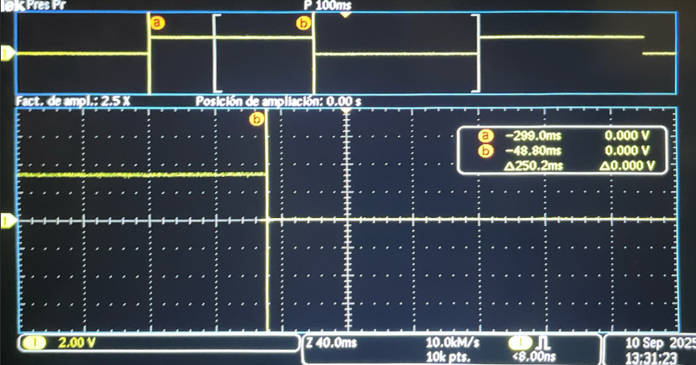
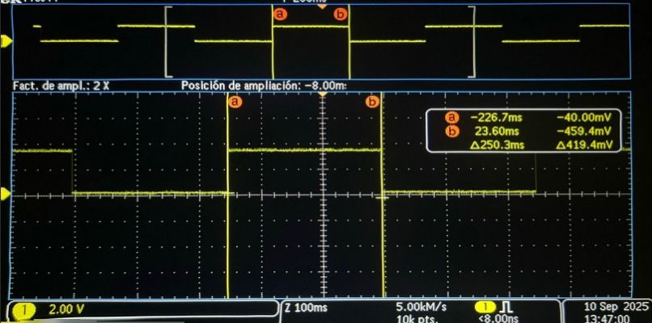

# Comparativa de codigos optimizados

> Plantilla genérica para documentar proyectos académicos o de ingeniería.  
> Copia y adapta las secciones según tu necesidad.

---

## 1) Resumen

- **Nombre del proyecto:** Blink con temporizador (alto y bajo nivel) en Raspberry Pi Pico  
- **Autor:** _Antonio Martinez_  
- **Curso / Asignatura:** _Sistemas Embebidos_  
- **Fecha:** _10/09/2025_  
- **Descripción breve:** Implementación y comparación de dos enfoques para parpadear un LED en la Raspberry Pi Pico: (1) **SDK de alto nivel** con `add_repeating_timer_ms` y (2) **bajo nivel** programando **ALARM0** e **IRQ** del periférico **TIMER**.

!!! tip "Consejo"
    Mantén este resumen corto (máx. 5 líneas). Lo demás va en secciones específicas.

---

## 2) Objetivos

- **General:** Evaluar precisión, simplicidad y control de dos métodos de temporización (alto vs. bajo nivel) para el parpadeo de un LED en la Pico.
- **Específicos:**
  - Implementar un parpadeo con **timer de alto nivel** (SDK).
  - Implementar un parpadeo con **timer de sistema + ALARM0 + IRQ**.
  - Comparar **periodo efectivo** y **estabilidad** de ambos enfoques mediante mediciones/observaciones.
  - Documentar configuración, código y resultados.

## 3) Alcance y Exclusiones

- **Incluye:**
  - Código C para Pico (RP2040/RP2350).
  - Explicaciones de configuración GPIO y temporizadores.
  - Fórmulas de periodo/frecuencia y tabla de parámetros.
  - Secciones para insertar capturas/mediciones.

- **No incluye:**
  - Medidas con instrumentos específicos (osciloscopio/analizador lógico) **(pueden anexarse como evidencia)**.
  - Optimización avanzada de latencia fuera del alcance didáctico.

---

## 4) Requisitos

**Software**
- Pico SDK (v1.x–v2.x)
- CMake (≥ 3.13)
- Toolchain GCC ARM (ej. `arm-none-eabi-gcc`)
- `picotool` (opcional, para flasheo)
- Git


**Hardware**
- Raspberry Pi Pico / Pico 2 (RP2040/RP2350)
- LED en **GP15** (si tu placa no trae LED en ese pin) + resistencia (220–1kΩ)
- Osiloscopio

**Conocimientos previos**
- C básico
- Electrónica digital básica (GPIO, resistencias)
- Flujo de compilación con Pico SDK

---

## 5) Codigo 1 y resultados

```c
// Blink con timer (SDK alto nivel): cambia BLINK_MS para ajustar
#include "pico/stdlib.h"
#include "pico/time.h"

#define LED_PIN 15              // <-- usar GPIO 15 (GP15)
static const int BLINK_MS = 250;

bool blink_cb(repeating_timer_t *t) {
    static bool on = false;
    gpio_put(LED_PIN, on = !on);
    return true;
}

int main() {
    stdio_init_all();

    gpio_init(LED_PIN);
    gpio_set_dir(LED_PIN, GPIO_OUT);  // mejor usar GPIO_OUT que true

    repeating_timer_t timer;
    add_repeating_timer_ms(BLINK_MS, blink_cb, NULL, &timer);

    while (true) {
        tight_loop_contents();
    }
}
```

**Resultados**
  

## 6) Codigo 2 y resultados

```c
// Blink con timer de sistema (bajo nivel): programando ALARM0 e IRQ
#include "pico/stdlib.h"
#include "hardware/irq.h"
#include "hardware/structs/timer.h"

#define LED_PIN 15    
#define ALARM_NUM     0  // usaremos la alarma 0

// Calcula el número de IRQ para esa alarma 
#define ALARM_IRQ     timer_hardware_alarm_get_irq_num(timer_hw, ALARM_NUM)

static volatile uint32_t next_deadline;   // próximo instante (en us) en 32 bits bajos
// Por defecto el timer cuenta µs (no cambiamos la fuente).
static volatile uint32_t intervalo_us = 250000u;    // periodo en microsegundos

void on_alarm_irq(void) {
    // 1) Limpiar el flag de la alarma
    hw_clear_bits(&timer_hw->intr, 1u << ALARM_NUM);

    // 2) Hacer el trabajo toggle LED
    sio_hw->gpio_togl = 1u << LED_PIN;

    // 3) Rearmar la siguiente alarma con "deadline acumulativo"
    next_deadline += intervalo_us;
    timer_hw->alarm[ALARM_NUM] = next_deadline;
}

int main() {
    stdio_init_all();

    // Configura el LED
    gpio_init(LED_PIN);
    gpio_set_dir(LED_PIN, true);

    // "now" = 32 bits bajos del contador (tiempo en µs)
    uint32_t now_us = timer_hw->timerawl;          // lectura 32b (low) del contador
    next_deadline = now_us + intervalo_us;         // primer deadline

    // Programa la alarma
    timer_hw->alarm[ALARM_NUM] = next_deadline;

    // Crea un handler exclusivo para ligar el callback a la IRQ de la alarma
    irq_set_exclusive_handler(ALARM_IRQ, on_alarm_irq);
    // Habilita dentro del periférico TIMER la fuente de interrupción para la alarma ALARM_NUM inte = interrupt enable
    hw_set_bits(&timer_hw->inte, 1u << ALARM_NUM);
    //Habilita la IRQ en el NVIC (controlador de interrupciones del núcleo)
    irq_set_enabled(ALARM_IRQ, true);

    while (true) {
        // Mantén el bucle principal libre; lo pesado va aquí, no en la ISR
        tight_loop_contents();
    }
}
```

**Resultados**
  


## 7) Comparativa y conclusiones

**Resumen de la medición.** Con ambos programas configurados para conmutar cada **250 ms**, se observó una diferencia de **0.1 ms** a favor del enfoque **de bajo nivel** (ALARM0 + IRQ), es decir, el de bajo nivel fue ligeramente más rápido.

| Método                      | \(T_{\text{toggle}}\) medido | Desviación vs 250 ms | Comentario breve |
|----------------------------|------------------------------:|---------------------:|------------------|
| Alto nivel (repeating_timer)| 250.1 ms                      | +0.1 ms              | Despacho mediante callback del SDK |
| Bajo nivel (ALARM0 + IRQ)   | 250.0 ms                      | 0.0 ms               | Programación directa de alarma + `sio_hw->gpio_togl` |


**Interpretación.**
- El **alto nivel** introduce una pequeña latencia por la **capa de abstracción** (gestión del callback, comprobaciones internas), lo que explica el retardo adicional de ~0.1 ms.
- El **bajo nivel** programa el “deadline” en el temporizador de hardware y conmuta el pin vía **SIO** (`sio_hw->gpio_togl`) dentro de la ISR, reduciendo el **overhead** y la **deriva** acumulada.

**Conclusiones prácticas.**
- Para aplicaciones **didácticas o de prototipado**, el enfoque **alto nivel** es suficiente y más legible.
- Para requisitos de **precisión temporal** o ventanas largas (minimizando deriva/jitter), el enfoque **bajo nivel** es preferible.
- Aunque la diferencia medida (**0.1 ms**) es pequeña, confirma que la ruta **ALARM0 + IRQ** ofrece **mejor control temporal** con el mismo parámetro nominal.

**Notas de medición.**
- Asegurar condiciones comparables (misma alimentación, misma carga en el pin y entorno) y, si es posible, repetir varias veces y reportar **promedio y desviación**.
- El contador de 32 bits del TIMER “envuelve” ~cada 71.6 min; el uso de **deadline acumulativo** mantiene el ritmo al pasar por el wrap-around.
