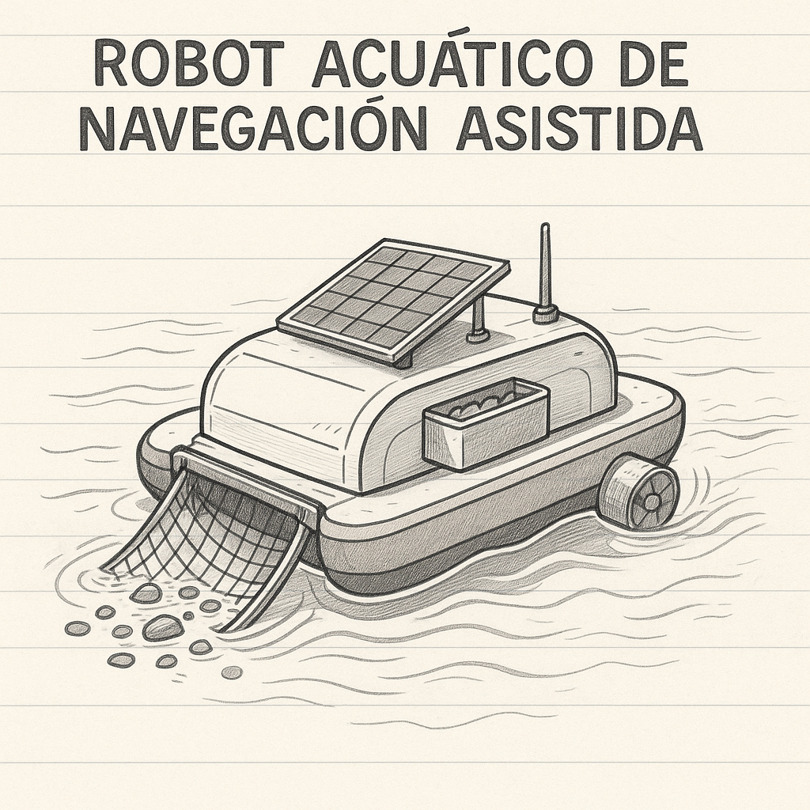

## RANA

La contaminación de lagos, estanques y pequeños cuerpos de agua es un problema creciente que afecta tanto al medio ambiente como a las comunidades locales. La acumulación de basura plástica, hojas y residuos orgánicos provoca daños en la biodiversidad, genera malos olores y dificulta el acceso al agua para fines recreativos o agrícolas.  

La limpieza manual de estos espacios resulta complicada y poco eficiente, por lo que surge la necesidad de soluciones accesibles, autónomas y adaptadas a estos entornos. Este proyecto propone el diseño de un **robot acuático de navegación asistida**, capaz de recolectar residuos flotantes de forma económica, sustentable y escalable:contentReference[oaicite:0]{index=0}.  

[Descargar especificación (PDF)](recursos/archivos/Prototipo.pdf)

<object data="../recursos/archivos/Prototipo.pdf" type="application/pdf" width="100%" height="600">
  
No se pudo mostrar el PDF. <a href="../recursos/archivos/Prototipo.pdf">Descargar</a>

</object>

---
**RANA**
  

## Analisís sobre la problematica:

[Descargar especificación (PDF)](recursos/archivos/rana2.pdf)

<object data="../recursos/archivos/rana2.pdf" type="application/pdf" width="100%" height="600">
  
No se pudo mostrar el PDF. <a href="../recursos/archivos/rana2.pdf">Descargar</a>

</object>

## Diagrama de Gantt de las actividades que se realizaran:

[Descargar especificación (PDF)](recursos/archivos/RANA_diagrama.pdf)

<object data="../recursos/archivos/RANA_diagrama.pdf" type="application/pdf" width="100%" height="600">
  
No se pudo mostrar el PDF. <a href="../recursos/archivos/RANA_diagrama.pdf">Descargar</a>

</object>

# RANA — Robot Acuático de Navegación Asistida  
**Aplicación de la diapositiva “Creando Valor” al proyecto RANA**

---
| Categoría             | Descripción |
|-----------------------|-------------|
| Socios Clave          | - Compañeros y profesores que nos ayuden a mejorar el diseño.    - Laboratorios de la universidad donde podamos probar el robot.    - Proveedores de piezas básicas (motores, sensores, paneles solares pequeños).    - Comunidades que nos permitan probar el robot en estanques pequeños. |
| Actividades Clave     | - Diseñar y armar el prototipo.    - Probarlo en agua para evaluar limpieza.    - Instalar sensores básicos.    - Dar mantenimiento y ajustar diseño.    - Difundir el proyecto en redes o carteles. |
| Propuesta de Valor    | - Robot económico y fácil de usar.    - Funciona autónomo o con control remoto.    - Mide parámetros básicos del agua.    - Limpia pequeñas áreas y genera conciencia ambiental. |
| Relación con Clientes | - Enseñar a usar el robot.    - Pedir retroalimentación.    - Colaborar con grupos ambientales. |
| Segmentos de Clientes | - Universidades o laboratorios.    - Comunidades con estanques.    - Grupos estudiantiles ambientales. |
| Recursos Clave        | - Arduino, sensores, motores, baterías.    - Taller o laboratorio.    - Tú y tus compañeros.    - Materiales reciclables o económicos. |
| Canales               | - Presentaciones en la universidad.    - Redes sociales.    - Ferias estudiantiles de innovación. |
| Estructura de Costos  | - Compra de componentes básicos.    - Ensamblaje y pruebas.    - Materiales de difusión. |
| Fuentes de Ingreso    | - Apoyo de la universidad o becas.    - Premios en concursos estudiantiles.    - Posible venta a laboratorios o grupos estudiantiles. |
## 1) La oferta: ¿qué quiere la gente?

### Rango de productos (oferta)
- **RANA Go (MVP)** — Robot de limpieza con **navegación asistida** (teleoperado con ayudas de rumbo y anticolisión), **skimmer** para sólidos flotantes, **filtro** fino y **telemetría básica** (turbidez, temperatura).
- **RANA Pro** — Semi-autónomo con **rutas guiadas**, geocercas, **detección de obstáculos (LiDAR/cámara/US)**, **mapas de calor de basura** y **reportes automáticos** para cumplimiento (antes/después, kg recogidos, horas de operación).

- **Servicios complementarios**: estudio inicial (línea base de contaminación), mantenimiento preventivo, retiro y disposición certificada, suscripción de **monitoreo ambiental** (turbidez, pH, DO, clorofila, cianobacterias opcional).

### Segmentos objetivo (targeted)
1. **Municipios y organismos de agua** (lagos urbanos, canales).
2. **Administradores de parques y clubs náuticos** (imagen pública, seguridad sanitaria).
3. **Hoteles y marinas privadas** (experiencia del visitante).
4. **Universidades/labs ambientales** (datos y campo).

---

## 2) Propuesta de valor (INSIGHTFUL • UNIQUE • TARGETED)

**Dolores reales**: limpieza manual costosa e intermitente; quejas vecinales por mal olor/algas; falta de **datos verificables** para justificar presupuesto.  
**Ganancias**: limpieza **más frecuente y segura**, **evidencia cuantificada** para reportes y decisiones, operación **silenciosa** y con **bajo OPEX**.

**ÚNICA (Unique)**
- Navegación **asistida**: combina control humano con ayudas inteligentes (mantener rumbo, evitar colisiones, “limpia-en-ruta” optimizada).
- **Data-first**: reportes con **kg/hora, m² cubiertos, turbidez** y mapas de calor → justifica inversión y muestra impacto.
- **Modular**: skimmer, microalga boom, micro-dragado ligero, sensor pack opcional.

**DIRIGIDA (Targeted)**
- “Pequeños-medianos cuerpos de agua urbanos (1–50 ha) con basura flotante recurrente y presión social por imagen/olores”, responsable: **Dirección de Parques/Servicios Públicos**.

---

# Creando Valor — RANA (Robot Acuático de Navegación Asistida)

| **INSIGHTFUL** (Necesidades reales) | **UNIQUE** (Difícil de replicar) | **TARGETED** (Cliente apasionado) |
|---|---|---|
| Limpieza **frecuente y segura** de lagos/canales urbanos. | **Navegación asistida**: rumbo estable, retorno seguro y **anticolisión**. | **Municipios/organismos de agua** con presión por quejas vecinales. |
| **indicadores cuantificables** para justificar presupuesto (kg de residuos, m² cubiertos, turbidez reducida). | Operación **data-first** con reportes automáticos y **mapas de calor** de basura. | **Direcciones de Parques/Servicios Públicos** responsables de imagen y sanidad. |
| Respuesta **rápida post-lluvias** y en temporadas altas de residuos. | **Arquitectura modular** (skimmer, sensores, micro-dragado) según sitio. | **Marinas/hoteles** que cuidan la experiencia visual del visitante. |
| Servicio integral: **recolección + disposición** y **mantenimiento** con OPEX bajo. | **Autodiagnóstico y mantenimiento predictivo** (horas de motor, baterías) | **Universidades/labs ambientales** que requieren campañas de monitoreo con evidencia. |

---

## VALUE PROPOSITION
**RANA mantiene limpios los cuerpos de agua con navegación asistida y entrega evidencia medible (kg recolectados, m² cubiertos, turbidez) para reducir quejas y **justificar presupuesto** con datos.**

## Costos del producto:

[Descargar especificación (PDF)](recursos/archivos/costos_rana.pdf)

<object data="../recursos/archivos/costos_rana.pdf" type="application/pdf" width="100%" height="600">
  
No se pudo mostrar el PDF. <a href="../recursos/archivos/costos_rana.pdf">Descargar</a>

</object>